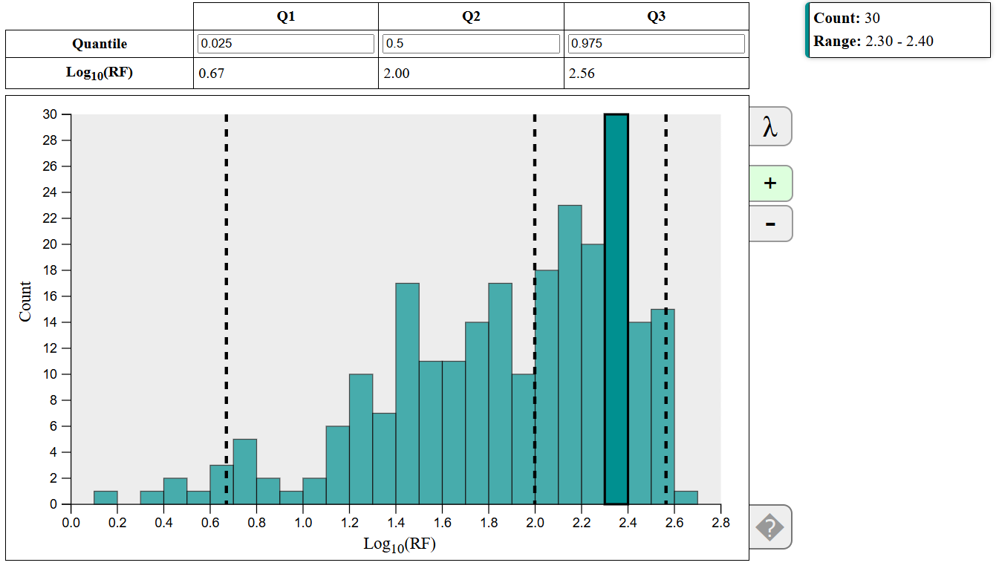

# INTERPRET NTA qNTA Interactive Log(RF) Histogram

**Author:** E. Tyler Carr

This plot is for the INTERPRET NTA qNTA suite of visualizations. It is a histogram of the log of chemical response factors (RF).

$$
\text{RF} = \frac{\text{abundance}}{\text{concentration}}
$$

There is an option to apply a Box Cox transformation to your data.

## Dependencies

This project requires the following libraries:

- [D3.js](https://d3js.org/) (version 7)
- [SheetJS (xlsx)](https://sheetjs.com/) (version 0.17.0)

## Box Cox

The goal of the Box Cox transformation is to turn non-normal data into a normal distribution.

$$
x' = \frac{x^\lambda - 1}{\lambda} \quad \text{where } \lambda \neq 0
$$
$$
x' = \log x \quad \text{where } \lambda = 0
$$

Values for $\lambda$ generally range from -5 to 5, but should be chosen such that it maximizes the normalcy of your data. In order to optimize our choice of lambda, we will calculate the log-likelihood for a normal distribution and choose the value of lambda that maximizes this.

### Box Cox log likelihood (from scipy source code)

$$
llf = (\lambda - 1) \sum_i(\log(x_i)) -
              N/2 \log(\sum_i (y_i - \bar{y})^2 / N),
$$

where $y$ is the boxCox transform of the input data $x$

### Grid search

This code calculates the log-likelihood of our transformed data checking 1,000 values of lambda: -5 to +5 in 0.01 increments. The value of $\lambda$ that maximizes our log-likelihood is the optimal value.

## Functionality

By default, a histogram of the log(RF) values for ESI+ mode data is shown.

It is noted that each section below ends with a GIF. It may take a while for these to load depending on network speed. Any checkered appearance in the GIFs are artifacts generated while converting from MP4 to GIF.

### On-Hovers and Toggling ESI+/ESI- modes

Hovering over a bin will highlight that bin and populate a tooltip in the top right with the bin count and the range of log(RF) values that bin encompasses.

Clicking on the "-" button on the right side will toggle the ESI- mode data if provided. Clicking the "+" button will toggle back to ESI+ mode.

### Quantiles

By default, vertical dashed lines exist at the 2.5%, 50% and 97.5% quantiles, the corresponding log(RF) values can be seen in the table above the histogram. These percentages can be changed by updating the input boxes in the "Quantile" row of the table.

### Toggle Box Cox Transformation

To apply a Box Cox transformation to your data, click on the $\lambda$ button in the top right of the histogram. Notice that hovering over this button displays a plot of the grid-search that was done to find the optimal value for $\lambda$. This is unique for both ESI+ and ESI- modes.

### Help Button

There is a help button in the bottom right of the histogram. Hovering over this button will display a tooltip that explains the functionality the histogram provides. Clicking this button will toggle the help tooltip so that it will not go away until you click the button again.

