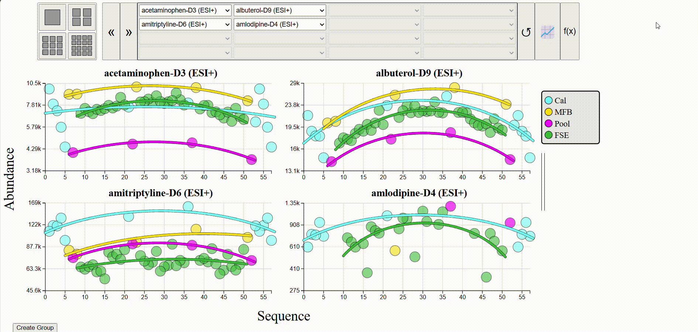

# INTERPRET NTA Run Sequence Plots

**GitHub:** <https://github.com/carret938/INTERPRET-NTA-Interactive_Run_Sequence_Plots>
**Author:** E. Tyler Carr

This repository is for the interactive run sequence plots for the INTERPRET NTA qNTA suite of visualizations.

This comes with a .xslx file filled with sample data to generate an example visualization.

## Dependencies

This project requires the following libraries:

- [D3.js](https://d3js.org/) (version 7)
- [SheetJS (xlsx)](https://sheetjs.com/) (version 0.17.0)

## Installation

To include these dependencies in your project, add the following `<script>` tags to your `index.html` file:

```html
<script src="https://d3js.org/d3.v7.min.js"></script>
<script src="https://cdnjs.cloudflare.com/ajax/libs/xlsx/0.17.0/xlsx.core.min.js"></script>
```

Otherwise, you can use relative imports using the local files `./js/d3.v7.min.js` and `./js/xlsx.core.min.js`.

## Functionality

The run sequence plots show the chemical abundance vs the sequence it was ran in. A legend is populated with the sample groups, as provided by the user in their sequence.csv file.


It should be noted that there are GIFs at the bottom of each section below. It can take a while for these to load depending on network speed.

### On-Hovers

Hovering over a node will populate the tooltip with data about that point. Notice that the vertical bar to the left of the tooltip changes color to match the group of the point you are hovering over.

Since samples are ran in replicate, hovering over a node will enlarge all other points corresponding to the same sample (e.g., in the example case below hovering over Sample NAME: D3S1_2 also highlights D3S1_1 and D3S1_3), making them easy to find.



### Resolution, Pagination and Dropdown Menus

By default, a 2x2 grid of plots is shown, displaying the first 4 chemicals of the dataset. This resolution may be toggled between 4 modes using the buttons in the top left, notably 1x1 (n = 1 plot), 2x2 (n = 4 plots), 3x3 (n = 9 plots) and 4x4 (n = 16 plots).

You may paginate to the next n chemicals by clicking the ">>" pagination button, or the previous n chemicals by clicking the "<<" button.

You can place any chemical from your dataset in any position within the grid of plots by using the dropdown menus to the right of the pagination buttons. There is also an option to leave the plots as a blank space.

The reset button to the right of the dropdown menus can be clicked to reset the plots to show the first n chemicals again.


### Toggling Best Fit Curves and Log/Linear Scales

By default, quadratic curves are fit through for each group in each plot, and is shown with a logarithmic y-scale. To toggle the best fit lines, you can click the button to the right of the reset button. To toggle between log and linear scales, you can click the "f(x)" button on the far right of the interface.


### Grouping

An unlimited number of custom groups can be made by clicking the "Create Group" button in the bottom right. Clicking the button once opens a box that acts as an interface for customizing your new group.

You can give your group a name and a description in the respective boxes. Chemicals may be added to the group by selecting one from the dropdown menu and clicking the "Add Chemical" button. Clicking the red bin beside a chemical in your group will remove it from the group.

Once populated with chemicals, you can choose to view only the chemicals in that group by clicking the glasses icon in the bottom right of the group interface.

A group may be deleted by clicking the red trash bin in the bottom right of the group interface. If the group has been assigned a name or has been populated with chemicals, a popup will display confirming that you meant to delete the group.


