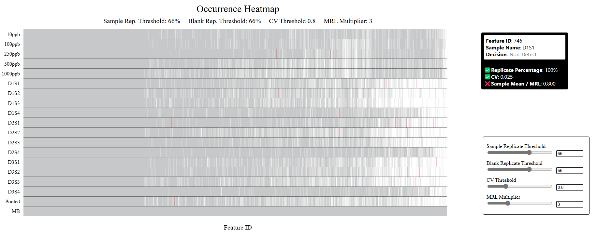
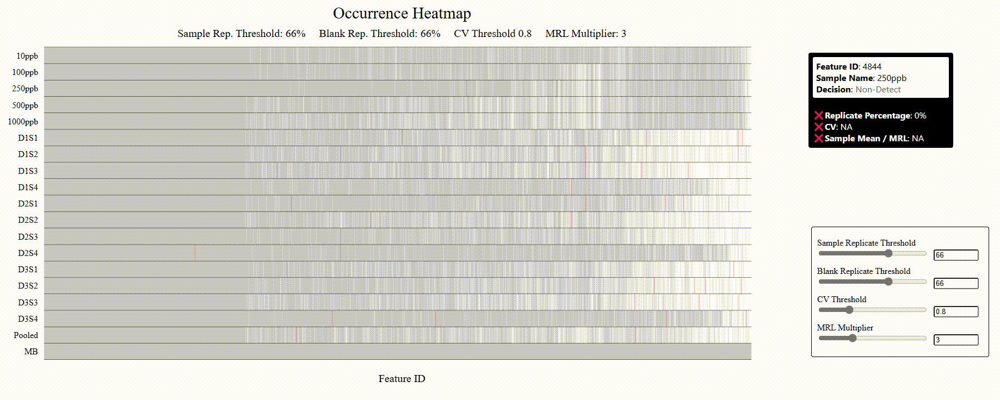

# INTERPRET NTA Interactive Occurrence Heatmap

**GitHub:** <https://github.com/carret938/INTERPRET-NTA-Interactive_Occurrence_Heatmap>
**Author:** E. Tyler Carr

This code produces an interactive occurrence heatmap for the INTERPRET NTA suite of visualizations. This is ran using Vite. After installing Vite, a server may be generated with your local host by running `npx vite`.

Due to the massive amount of data that might be visualized, Three.js was used. This means that the visualization is GPU accelerated, which may lag on older machines.

## Dependencies

This project requires the following libraries:

- Three.js: ^0.172.0
- Tween.js: ^0.9.0
- SheetJS (xlsx): ^0.17.0

## Development

This code is set upt to run without a node server. All of the dependences are linked via a CDN or included in the code.

On VS Code, install the plugin **Live Server (Five Server)**. To run the visualization, right click `index.html` and select **Open with Five Server**.

## Functionality

This plot shows a heatmap of occurrences from an INTERPRET NTA job. Each column represents a feature, and each row represents a sample. Every occurrence is checked against a replicate percentage threshold, a CV threshold and an MRL threshold (denoted by the (blank_mean + STD\*MRL_Multiplier)), whose default values are provided in the "Analysis Parameters.csv" file.

It should be noted that each section below ends with a GIF. It may take a while for these to load depending on network speeds.

### On-Hovers

Hovering over a cell will populate the tooltip to the right of the plot with data about that cell (more on this later).

Hovering over the title will display a tooltip with data about the entire plot, like the total number of features, samples and occurrences, and the number of occurrences that passed, failed and were non-detect.

Hovering over a y-axis label will generate a tooltip that is populated with data about that sample (total occurrences in that sample that passed/failed/were non-detects).

### Zooming and Cell On-Hovers

Due to the high density of data, you can zoom into a given region by clicking and dragging to draw a zoom-box. Letting go of the mouse will zoom the figure into this region, making it easier to mouse-over the cells of interest. At this point clicking and dragging will pan the figure. Hitting Ctrl+Space will zoom the plot back out to the original view, hitting Ctrl+Space again will zoom/pan the figure back to the last view.

Hovering over a cell will tell you the Feature ID, sample name and whether that occurrence was a Pass, Fail, or Non-detect. Right below this data within the tooltip you can see more information about how that occurrence passed/failed each QA/QC step. A red X to the left of the step indicates that it failed while a green check indicates that it passed.

### Widen Red Cells, and Update Parameter Thresholds

Clicking on the title will increase the thickness of all red cells, making it easier to hover over them without the need to zoom in. Clicking the title again or zooming will reset their thickness.

You can change your parameter thresholds by using the sliders in the bottom right and see how your data updates in real time.

## Licensing

### Code

The code in this repository is licensed under the [CC0 1.0 Universal (CC0 1.0) Public Domain Dedication](./LICENSE_CODE).

### Data

The dataset used in this project is licensed under a custom proprietary license. Please refer to the [data license file](./LICENSE_DATA) for more details.
